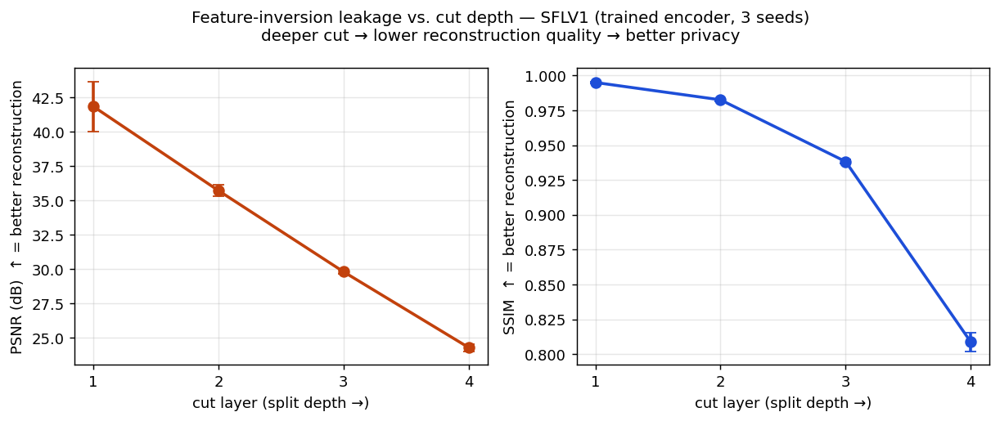
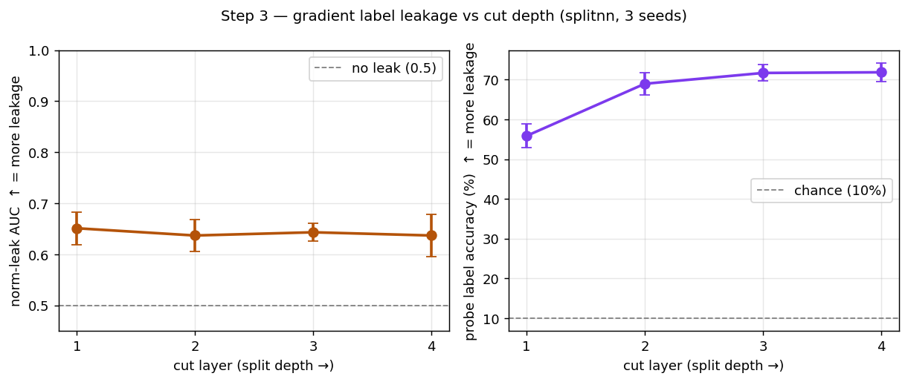
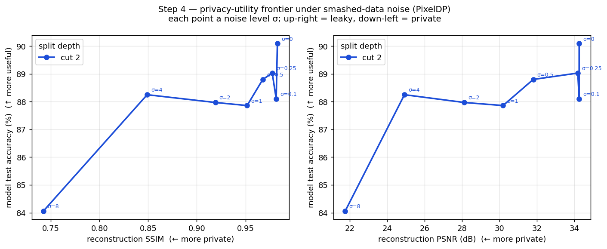

# How private is split federated learning?

**[Read the full paper (PDF)](how-private-is-the-cut.pdf)**

Code and results for the second half of my senior project. The first half reproduced
SplitFed learning (Thapa et al., AAAI 2022) on CIFAR-10 with a CIFAR-adapted ResNet18 and made
the cut layer configurable. This half asks the follow-up question: how much privacy does the
split actually buy? (The code comments call the two halves Q1 and Q2, after the quarters they
were built in.)

The pitch for split learning is that raw data never leaves the client. The network is cut in
two, the client runs the first few layers, and only the intermediate activations ("smashed
data") cross the wire. That sounds private. This repo measures whether it is: same testbed
throughout (ResNet18 / CIFAR-10, cut layers 1-4, 3 seeds for the cut sweeps), one attack on the
forward channel, two on the backward channel, and one defense.

## The three experiments

**1. Feature inversion (step 2).** An honest-but-curious server trains a decoder to reconstruct
the client's input image from the smashed data it already receives during training. The decoder
is just supervised learning on (activation, image) pairs, no fancy optimization. Result:
reconstruction quality falls steadily as the cut moves deeper. PSNR drops from 41.8 dB at cut 1
to 24.3 dB at cut 4, SSIM from 0.995 to 0.81. A cut-1 reconstruction is basically the original
image.



Per-cut reconstruction grids are in `figures/inversion_sflv1_trained_cut*_seed1234.png`.
Worth a look: the cut-1 vs cut-4 difference is obvious by eye.

**2. Gradient label leakage (step 3).** Two-party split learning where the labels stay with the
label party (the threat model from Li et al., ICLR 2022). The bottom party never sees labels,
only the gradient that comes back across the cut each step. That gradient talks: an
unsupervised norm attack separates vehicle from animal images with AUC around 0.64 at every
cut, and a supervised logistic-regression probe on the raw cut gradient recovers the 10-class
label at 56% accuracy at cut 1, rising to 69-72% at cuts 2-4. Chance is 10%.

The direction matters. Image leakage *falls* with depth, label leakage *rises*. Picking a
deeper cut to protect images makes the gradient side worse, so there is no single cut that is
just "more private."



**3. Noise defense (step 4).** Gaussian noise added to the smashed data before it crosses the
cut (the PixelDP-style defense the SplitFed paper itself suggests), swept at cut 2 (single
seed) with the inversion attack re-run against each noise level. For a while the noise hurts the attacker more
than the model: accuracy stays near 88% out to sigma=4 while reconstruction SSIM falls from
0.98 to 0.85. But the attack never dies: at sigma=8 the reconstruction still has PSNR ~22 dB /
SSIM 0.74, and accuracy has now dropped to 84% (from 90.1% undefended). Degraded, not defeated,
and you pay for it.



There's also the step-1 training harness for all five baseline methods (centralized, FL, SL,
SFLV1, SFLV2) with multi-seed support, carried over from the first half of the project. The
SFLV1 cut sweep used by the attacks lands at 74-79% mean test accuracy across cuts after 50
rounds (one local epoch per round).

## What's new here and what isn't

Honesty section. The depth-vs-reconstruction curve is a reproduction: He et al. (ACSAC 2019)
showed it for collaborative inference, and Lee et al. (IEEE Network 2024) showed it inside SFL.
Noise on the smashed data appears as a defense in the SplitFed paper itself. What this repo
adds is one common testbed that runs the image attack, the label attack, and the defense on the
same SplitFed setup with multiple seeds, and the observation that the two leaks move in
opposite directions as the cut deepens.

## Setup

Python 3.10+. Then:

```bash
pip install -r requirements.txt
```

CIFAR-10 downloads itself into `data/` on first run. Device is picked automatically:
CUDA if you have it, MPS on Apple Silicon, otherwise CPU.

## Running everything

Step 1. Baselines and the SFLV1 cut sweep (checkpoints feed step 2):

```bash
# smoke test first
python scripts/run_baselines.py --mode baseline --epochs 1 --seeds 1234

# the full cut sweep the attacks use (saves client encoder checkpoints)
python scripts/run_baselines.py --mode cutsweep --epochs 50 --base_channels 64 \
    --seeds 1234 2026 42 --save_client_ckpt
```

Step 2. Invert the trained encoders:

```bash
python scripts/run_attacks.py --seeds 1234 2026 42 --epochs 30
python scripts/make_step2_figure.py
```

Step 3. Label leakage from the cut gradient:

```bash
python scripts/run_label_leakage.py --seeds 1234 2026 42 --train_epochs 15
python scripts/make_step3_figure.py
```

Step 4. The noise defense frontier:

```bash
python scripts/run_defenses.py --cut_layers 2 --seeds 1234 --sigmas 0 0.1 0.25 0.5 1.0 2.0 4.0 8.0
python scripts/make_step4_figure.py
```

The full sweeps take a while (the cut sweep alone is 12 training runs). Every run writes a CSV
into `results/`. The ones used in my report are checked in, so the `make_step*_figure.py`
scripts work out of the box without retraining anything.

One gotcha: the method scripts in `src/baselines/` default to a lightweight 16-channel model
when run directly (fast on CPU). The orchestrators and the attack scripts default to the
full-width 64-channel model, and the checkpoint loader errors loudly on a mismatch, so pass
`--base_channels 64` if you run a baseline script by hand and want its encoder attacked.

## Layout

```
src/utils.py          shared models (ResNet18 + split variants) and data code
src/baselines/        the 5 training methods
src/attacks/          feature inversion (decoder, metrics) + label leakage
src/defenses/         noisy-channel defense + frontier
scripts/              sweep runners and figure makers
results/              CSVs from the runs behind the report
figures/              the three summary figures + sample reconstruction grids
```

## References

- Thapa, Chamikara, Camtepe, Sun. *SplitFed: When Federated Learning Meets Split Learning.* AAAI 2022.
- He, Zhang, Lee. *Model Inversion Attacks Against Collaborative Inference.* ACSAC 2019.
- Li, Wen, et al. *Label Leakage and Protection in Two-Party Split Learning.* ICLR 2022.
- Lee, Seif, Cho, Poor. *Exploring the Privacy-Energy Consumption Tradeoff for Split Federated Learning.* IEEE Network 2024.
